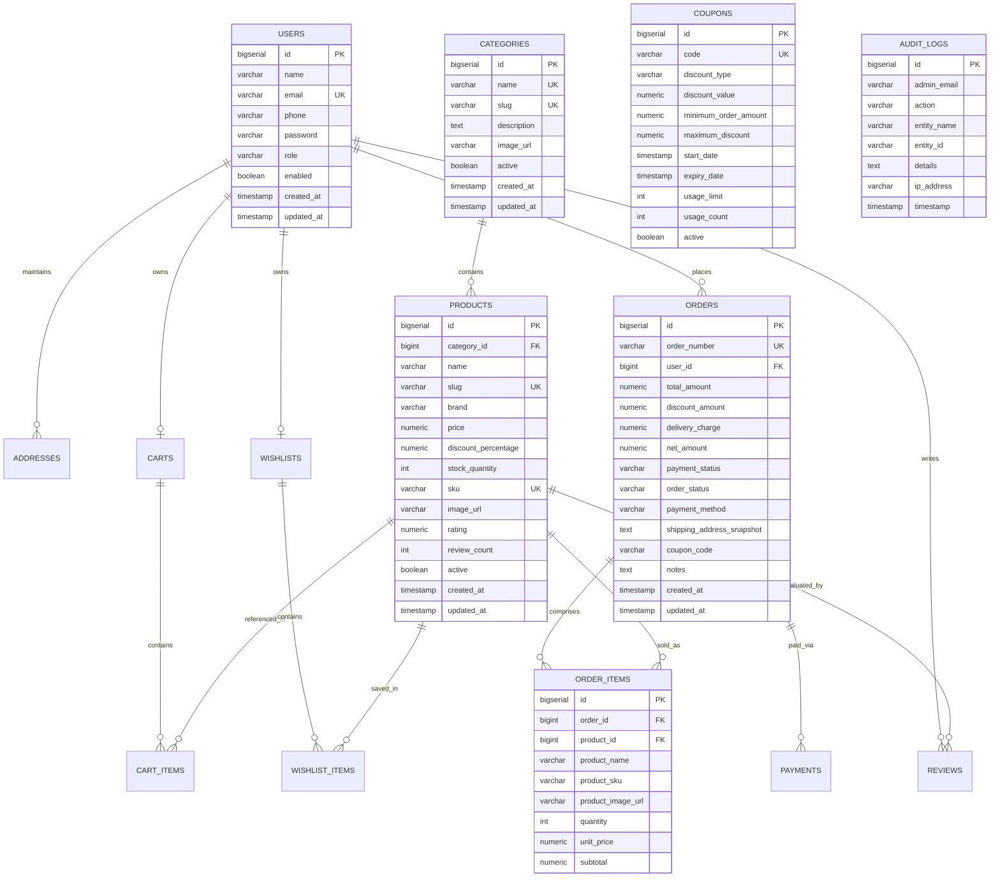

# Database Design & Entity Relationship Specifications

## 1. Relational ER Diagram

---

## 2. Table DDL & Relationships

### `users`
- Stores user credentials and authorization roles (`USER`, `ADMIN`).
- Passwords are strictly hashed with **BCrypt**.
- `email` has a unique constraint to ensure identity isolation.

### `products`
- Maintains catalog metadata, brand, SKU code, real-time inventory count (`stock_quantity`), rating, and discount percentage.
- Indexes placed on `category_id`, `brand`, `active`, `price`, and `rating` for optimized searching and filtering.

### `orders` & `order_items`
- Maintains immutable snapshots of the shipping address and the exact unit price (`unit_price`) at the instant of order placement, preventing retroactive pricing modifications.

### `coupons`
- Supports both `PERCENTAGE` and `FIXED_AMOUNT` discount strategies with configurable validity windows, minimum purchase constraints, and usage caps.
